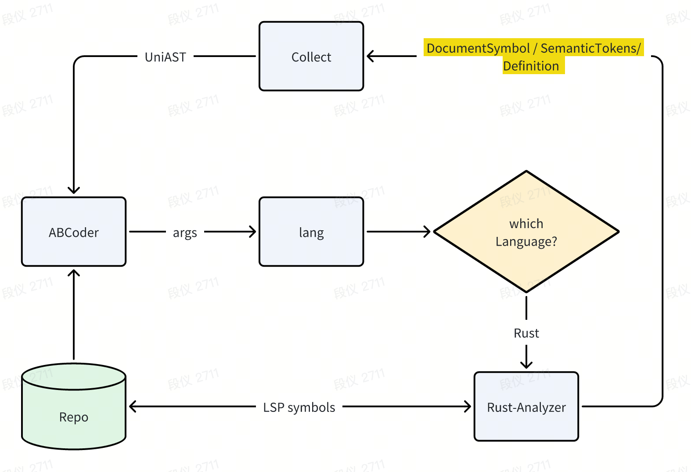

# ABCoder - Language Parser 介绍

当前 ABCoder 基于 [LSP](https://microsoft.github.io/language-server-protocol/) 协议实现 Parser ，以达到精确依赖收集，并方便后续多语言扩展

## 代码结构

位于 [lang](/lang) 包下，包括：

- uniast：统一 AST 结构的 golang 定义
- lsp：LSP 协议处理 client，提供了 文件解析、引用查找、语法树解析、定义查找等接口，以及**通用的语言规范 LanguageSpec 接口**
- collect：负责基于 LSP 符号收集和导出 UniAST，是核心运算逻辑
- {language}：主体是对 lsp#Spec 接口的对应 {language} 规范的实现。此外还有具体 LSP server 的一些具体调用逻辑

## 运算过程



1. 通过命令行参数识别语言启动对应 LSP server，并传入初始化参数
2. 遍历仓库文件，调用 `textDocument/documentSymbol` 方法获取每个文件的所有符号。对于每个符号
   1. 调用 `textDocument/semanticTokens/range` 方法获取符号代码中的 tokens
   2. 识别出有效实体的 token，调用 `textDocument/definition` 跳转到对应符号位置，从而建立节点依赖关系
3. 循环 2 直文件结束。最终将收集到的 lsp symbols 转换为 UniAST 格式并输出

## 扩展其它语言实现

由于 UniAST 并不完全等价 LSP， 因此需要实现一些特定语言专属的行为接口才能进行转换。参考 lang/rust 包，大体需要实现以下能力：

- GetDefaultLSP()：映射用户输入 language 到具体的 lsp.Language，以及对应的 LSP 名称
- CheckRepo()：检查用户仓库情况，根据各语言规范额处理工具链等问题，并返回默认打开的第一个文件（用于触发 LSP server），以及等候 sever 初始化完成的时间（根据仓库大小来决定）
- **LanguageSpec interface**: 核心模块，用于处理非 LSP 通用的语法信息、比如判断一个 token 是否是标准库的符号、函数签名解析等：

### LaunguageSpec

```
用于在 LSP 符号收集过程中转换为 UniAST 所需信息，并且这些信息非 LSP 通用定义

```go

// Detailed implementation used for collect LSP symbols and transform them to UniAST
type LanguageSpec interface {
    // initialize a root workspace, and return all modules [modulename=>abs-path] inside
    WorkSpace(root string) (map[string]string, error)

    // give an absolute file path and returns its module name and package path
    // external path should alse be supported
    // FIXEM: some language (like rust) may have sub-mods inside a file, but we still consider it as a unity mod here
    NameSpace(path string) (string, string, error)

    // tells if a file belang to language AST
    ShouldSkip(path string) bool

    // FileImports parse file codes to get its imports
	FileImports(content []byte) ([]uniast.Import, error)

    // return the first declaration token of a symbol, as Type-Name
    DeclareTokenOfSymbol(sym DocumentSymbol) int

    // tells if a token is an AST entity
    IsEntityToken(tok Token) bool

    // tells if a token is a std token
    IsStdToken(tok Token) bool

    // return the SymbolKind of a token
    TokenKind(tok Token) SymbolKind

    // tells if a symbol is a main function
    IsMainFunction(sym DocumentSymbol) bool

    // tells if a symbol is a language symbol (func, type, variable, etc) in workspace
    IsEntitySymbol(sym DocumentSymbol) bool

    // tells if a symbol is public in workspace
    IsPublicSymbol(sym DocumentSymbol) bool

    // declare if the language has impl symbol
    // if it return true, the ImplSymbol() will be called
    HasImplSymbol() bool
    // if a symbol is an impl symbol, return the token index of interface type, receiver type and first-method start (-1 means not found)
    // ortherwise the collector will use FunctionSymbol() as receiver type token index (-1 means not found)
    ImplSymbol(sym DocumentSymbol) (int, int, int)

    // if a symbol is a Function or Method symbol,  return the token index of Receiver (-1 means not found),TypeParameters, InputParameters and Outputs
    FunctionSymbol(sym DocumentSymbol) (int, []int, []int, []int)
}
```

- Rust-parser 实现位置：[RustSpec](/lang/rust/spec.go)

```
